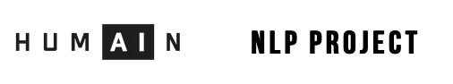

[![Contributors][contributors-shield]][contributors-url]
[![LinkedIn][linkedinDU-shield]][linkedinDU-url]
[![LinkedIn][linkedinCS-shield]][linkedinCS-url]
[![LinkedIn][linkedinOD-shield]][linkedinOD-url]
[![LinkedIn][linkedinCG-shield]][linkedinCG-url]

<!-- PROJECT LOGO -->
<br />
<p align="center">
  <a href="https://github.com/gietsc/HumAIn-Project/">
    
  </a>
  <p align="center">
As part of our AI training at BeCode Brussels, our team has been assigned with this NLP project for HumAIn.
HumAIn is an AI consultancy company that helps your organisation to cost-effectively integrate AI technologies, shooting for exponential growth opportunities. 
    <br/>
    <br/>
    <a href="https://github.com/gietsc/Humain-project"><strong>Explore our Demo »</strong></a>
</p>


<!-- TABLE OF CONTENTS -->
<details open="open">
  <summary>Table of Contents</summary>
  <ol>
    <li>
      <a href="#about-the-project">About The Project</a>
      <ul>
        <li><a href="#built-with">Built With</a></li>
      </ul>
    </li>
    <li>
      <a href="#getting-started">Getting Started</a>
      <ul>
        <li><a href="#prerequisites">Prerequisites</a></li>
        <li><a href="#installation">Installation</a></li>
      </ul>
    </li>
    <li><a href="#contact">Contact</a></li>
    <li><a href="#acknowledgements">Acknowledgements</a></li>
  </ol>
</details>

## Disclaimer

Following the reception of our assignement, it appeared clear that our methological approach would be evaluated over this project, and therefore the ReadMe file might be unecessary complete and informative for external .
These are preleminary notes that will be used to synthesise our methodological approach for the project.
Some areas contain incomplete data that will be filled later.
Also this is my own interpretation of the situation feel free to correct me if anything is not correct.

<!-- ABOUT THE PROJECT -->
## About The Project

The objective is to develop an NLP model based on data provided by HumAIn. As a bonus, we should create a full pipeline with our model to ideally, provide a working product to HumAIn. In this project, HumAIn will act as the final customer. The Project should be focused as it was for a realcustomer and therefore it is important we that in mind all along the proejct. 
 
Project Duration : 10 working days
Presentation Duration : 10 minutes

[![Product Name Screen Shot][product-screenshot]](https://github.com/gietsc/HumAIn-Project/)


### Built With

This section should list any major frameworks that you built your project using. Leave any add-ons/plugins for the acknowledgements section. Here are a few examples.
* [Python](https://www.python.org/)
* [Docker](https://www.docker.com/)
* [Heroku](https://heroku.com/)


<!-- GETTING STARTED -->
## Getting Started

This project has been assigned with really small directives (voluntarly) and is "carte blanche" which sets up a real challenge to be ambitious enough to envision a clean and efficient solution, while being reasonable enough with the management of our limited ressources.

In order to tackle our project, it was important to understand each other's knowledge about NLP and our individual understanding of what was asked of us.
That's why we summerized the most needed areas of knowledge that would be required to grasp our potential and set up our goals.

First since providing a demo isn't the main objective we had to evaluate with our skill pool how effectienlty we could set up a demo.
Building a solid pipeline would require following skills :
* Setting up an API
* Setting up a front end with a CMS
* Deploying the project (Heroku, Docker)
* Python knowledge 
* General Coding knowledge about architecture
* Understanding of AI models
* Understaning of NLP

After a quick round table we confirmed most skills were covered by at least one person in the team except for NLP, which we all just started to learn 5 days ago.

Since it's the center of the project it's important to understand were everybody's knowledge stood with theoretical and practical aspects of NLP. Since none of us were feeling comfortable enough, it became a necessity to figure out the most time efficent way for the whole team to get to know it. It's only then that we could be confident on the technical direction we want to take.

Luckily two members of the team were following a similar track course on Udemy that was quite complete. Also those members felt confident in their ability to finish this training in a short enough amount of time (3 days) and be share their knowledge to the rest of the team.

Meanwhile the rest of the team can start working on other aspects that don't involve the technical aspects of NLP. This involved :
* Setting up a shared document platform
* Setting up Github
* Setting up a Trello track?
* Setting up the starting block of the pipeline
* Setting up ways to keep track of the project's evolution (through this file)

More on setting up the pipeline :
While it's not clear yet how we will tackle this project and what our main objective is, we do know that (for time efficienty reasons) we will be using the Spacy library.
Therefor we can already start extracting and preprocessing the data that was provided before everybody's on the same page with NLP Knwoledge.
A .py file with a method 'import_data()' that returns each document provided by HumAIn in a workable format (Spacy token, dataframe, etc)

After covering the technical part, we assested everyone's softskills and how to put them in good use. (more on this to come)

Now that we had a clearer vision of where we were heading, we could start thinking about some short/mid/long term objectives.

#### Project Objectives:

*Provide Presentation / Working methodology / Demo (in that order of priority)
*finish the technical part 3 days before the end

#### Personal Objectives :

* Selflearn as a team NLP in 3 days
* setting up the first step of the pipeline (import_data() method)
* Gather questions to ask to the client in 3 days

### Prerequisites

This is an example of how to list things you need to use the software and how to install them.
* Example
  ```example
  ```

### Installation

1. Get a free API Key at [https://example.com](https://example.com)
2. Clone the repo
   ```example
   git clone 
   ```
3. Install packages
   ```example
   ```
4. Enter your API in ``
   ```example
   ```


<!-- CONTACT -->
## Contact

Didier Ukanda - [@didier-ukanda](https://www.linkedin.com/in/didier-ukanda/) - didier.ukanda@gmail.com

Opaps Ditudidi - [@opapsditudidi](https://www.linkedin.com/in/opapsditudidi/) - opaps.ditudidi@gmail.com

Christophe Schellinck - [@christophe-schellinck](https://www.linkedin.com/in/christophe-schellinck/) - christopheschellinck@gmail.com

Christophe Giets - [@christophegiets](https://www.linkedin.com/in/christophegiets/) - christophe.giets@gmail.com

Project Link: [https://github.com/gietsc/humain-project](https://github.com/gietsc/humain-project)


<!-- ACKNOWLEDGEMENTS -->
## Acknowledgements
* [BeCode](https://becode.org/)
* [Img Shields](https://shields.io)
* [GitHub Pages](https://pages.github.com)


<!-- MARKDOWN LINKS & IMAGES -->
<!-- https://www.markdownguide.org/basic-syntax/#reference-style-links -->
[contributors-shield]: https://img.shields.io/github/contributors/gietsc/humain-project.svg?style=for-the-badge
[contributors-url]: https://github.com/gietsc/HumAIn-Project/graphs/contributors
[linkedinCG-shield]: https://img.shields.io/badge/-Giets.C-black.svg?style=for-the-badge&logo=linkedin&colorB=555
[linkedinCG-url]: https://linkedin.com/in/christophegiets/
[linkedinCS-shield]: https://img.shields.io/badge/-Schellinck.C-black.svg?style=for-the-badge&logo=linkedin&colorB=555
[linkedinCS-url]: https://www.linkedin.com/in/christophe-schellinck/
[linkedinOD-shield]: https://img.shields.io/badge/-Ditudidi.O-black.svg?style=for-the-badge&logo=linkedin&colorB=555
[linkedinOD-url]: https://www.linkedin.com/in/opapsditudidi/
[linkedinDU-shield]: https://img.shields.io/badge/-Ukanda.D-black.svg?style=for-the-badge&logo=linkedin&colorB=555
[linkedinDU-url]: https://www.linkedin.com/in/didier-ukanda/
[product-screenshot]: assets/images/screenshot.png
